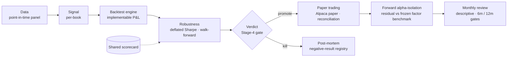

# alpha-lab


A systematic research platform for testing whether apparent alpha survives the things that kill it in
practice — lookahead, survivorship, transaction costs, implementable P&L accounting, estimator choice,
and forward validation. **One shared honest scorecard**, every verdict kept on the record.

**Right now the lab is running one live forward test.** Everything below is what is *currently being
monitored and tested*. The full back-history — the retired Sharpe-3.8 case study, the hunt2026
tournament, the James-Stein program, and every kill — lives in **[HISTORY.md](HISTORY.md)**.

---

## What's live now — the forward alpha-isolation test

Seven paper books trade on Alpaca paper. The open question, set by the [factor-risk
program](HISTORY.md#james-stein--factor-risk-program-2026-07-14): these books are **factor-premium
harvesters** — so the test is whether *any* return survives beyond a frozen factor-replication
benchmark, after costs and financing. Each book's daily residual is logged write-once; no allocation,
weight, or strategy-logic change is made from it before the gates below.

**Started 2026-07-15 · next gate 6m (2027-01-14, descriptive) · verdict gate 12m (2027-07-14).**
JSE is not deployed anywhere in this layer.

### The three clusters under monitoring

**QQQ vol / trend**
| book | what it is |
| ---- | ---------- |
| `vol_managed_qqq` | vol-managed QQQ — target-vol leverage on the Nasdaq |
| `vol_core_svxy` | short-vol core (SVXY) |
| `trend_vol_qqq` | SMA200 trend gate + vol targeting on QQQ (the robust single-asset design) |

**Momentum**
| book | what it is |
| ---- | ---------- |
| `dual_momentum_gem` | dual-momentum GEM — regime switch across global equity |
| `dual_momentum_gold` | dual momentum with a gold sleeve |
| `momentum_concentrated` | concentrated cross-sectional stock momentum (sub-market beta) |

**Defensive / TSMOM**
| book | what it is |
| ---- | ---------- |
| `defensive_ensemble` | trend + vol-managed equity + cross-asset TSMOM — the round-2 risk-adjusted winner (flat through 2022) |

### How each book is judged forward

- **Benchmark:** `residual_t = book net return_t − replication_t − financing_t`, where replication is
  `RF + Σ βⱼ·Fⱼ` on **M2** (FF5 + Momentum + TSMOM proxy + QQQ-residual), plus a GLD factor for the two
  gold books. Betas frozen from blind-window estimates ([`research/attribution/`](research/attribution/)).
- **Write-once ledger:** `ledgers/hunt2026/alpha_forward/<series>.jsonl`, append-only, recompute-drift
  guarded. Monthly descriptive review via [`scripts/hunt_alpha_review.py`](scripts/hunt_alpha_review.py).
- **Pre-committed 12m rule:** residual-alpha claim needs NW-lag-5 t ≥ 2.4, positive in both halves, all
  placebo bands passing, surviving financing/cost stress → then independent replication. Otherwise
  **factor-premium harvesting confirmed** and factor-adjusted kill/demote rules replace raw-vs-SPY.
- **Placebos** (SPY/QQQ buy-hold, 1.5× static) run in the same framework, judged on pre-registered
  bands. A band miss is a pipeline stop, not a result.

Setup record (frozen thresholds): [`memos/alpha-forward-setup-2026-07-14.md`](memos/alpha-forward-setup-2026-07-14.md).

**Live status** &nbsp;·&nbsp; [operational status](STATUS.md) &nbsp;·&nbsp;
[dashboard](https://kristenharim.github.io/alpha-lab/dashboard.html) &nbsp;·&nbsp;
[Alpaca paper](https://app.alpaca.markets/paper/dashboard/overview) &nbsp;·&nbsp;
**History** → [HISTORY.md](HISTORY.md) · [case study](CASE_STUDY.md)

## Architecture



## Selected engineering

- **Implementable-P&L engine** — scores hedged returns (stock − lagged-beta·sector-ETF) and charges the
  hedge overlay's own turnover, after the residual-space accounting bug was found ([history](HISTORY.md)).
- **Frozen-benchmark forward accounting** — write-once daily residual ledger, revision embargo (day must
  trail the FF file by ≥ 10 trading days), first-append factor vintage is the series of record.
- **Exact C++/Python parity gate** — the C++ band state machine reproduces the pure-Python positions
  bit-for-bit ([`tests/test_fastbands_parity.py`](tests/test_fastbands_parity.py)).
- **Point-in-time universe + survivorship audit** — index membership as-of date; today's constituents
  are never back-filled ([`tests/test_universe.py`](tests/test_universe.py)).
- **Broker reconciliation + read-only monitoring** against Alpaca paper ([`tests/test_reconcile.py`](tests/test_reconcile.py)).
- **Isolated environments** — backtest (`.venv`) vs reporting/ML (`.venv-report`); the headline number
  is never re-run inside a notebook.

## Verified metrics

All repo-supported; none are live-trading claims.

- **219 passed, 1 skipped** (`pytest`), including the exact C++/Python parity gate.
- **Seven paper books** under one forward alpha-isolation test against a frozen factor benchmark.
- Books selected from a frozen candidate slate evaluated **once on a blind 12-month holdout**, then a
  **5-year backdated blind re-test** through the 2022 bear (see [HISTORY.md](HISTORY.md)).
- **Self-contained [audit bundle](audit-bundle/)** — spec + code + recompute steps + return series.

## Repository layout

| path | what |
| ---- | ---- |
| [`README.md`](README.md) | this — what's live now |
| [`HISTORY.md`](HISTORY.md) | retired tracks, the tournament, the JSE program, every kill |
| [`CASE_STUDY.md`](CASE_STUDY.md) | the featured Sharpe-3.8 post-mortem |
| [`core/`](core/) | shared data loaders, backtest engine, evaluation scorecard, broker adapter |
| [`research/attribution/`](research/attribution/) | frozen betas + the forward attribution pipeline |
| [`ledgers/hunt2026/`](ledgers/hunt2026/) | the live paper books' ledgers |
| [`memos/`](memos/) | verdicts, post-mortems, and the forward-test setup record |
| [`audit-bundle/`](audit-bundle/) | self-contained reproducibility package |

## Reproduce

```bash
python3 -m venv .venv && .venv/bin/pip install -e ".[dev]"
.venv/bin/pytest                                   # full suite, incl. the parity gate
.venv/bin/python scripts/hunt_alpha_review.py --selfcheck   # validate the forward replication chain
```

The backtest runs in `.venv`; the reporting/ML layer runs in an isolated `.venv-report` that only reads
the artifacts the backtest wrote — so the headline number stays reproducible.

---

*My role: I defined the research questions, validation protocol, architecture, and final verdicts. AI
coding agents assisted with implementation and documentation under repository tests and explicit
governance controls. Paper-account orders only; no live capital.*
