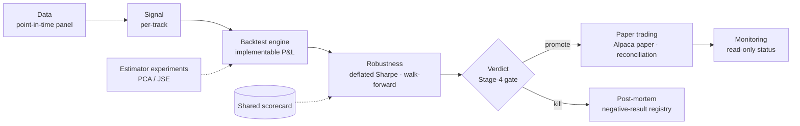

# alpha-lab


A systematic research platform for testing whether apparent alpha survives the things that kill it in
practice — lookahead, survivorship, transaction costs, implementable P&L accounting, estimator choice,
and forward validation. Several strategy tracks, **one shared honest scorecard**, every verdict kept on
the record including the kills.

### 📄 Featured case study — a Sharpe-3.8 backtest, retired

A market-neutral stat-arb strategy backtested at **3.80 gross Sharpe** and survived seven robustness checks before the accounting flaw was
identified. A diagnostic decomposition traced the number to P&L scored in *residual space* — crediting
each position with its own trailing drift, which no hedge can earn. Decomposing identical positions on
identical data (an exact accounting identity) split the headline number into what is real and what is not:

| book | gross Sharpe | ann. return |
| ---- | :----------: | :---------: |
| residual book (what the old engine scored) | **3.80** | +17.9% |
| raw stock book (implementable baseline) | 0.30 | +2.0% |
| beta-hedged book (implementable) | 0.42 | +2.0% |

The engine was corrected to book only implementable returns, a pre-registered salvage failed, and the
strategy was retired. **The post-mortem is the deliverable → [read the full case study](CASE_STUDY.md).**

**Start here** &nbsp;·&nbsp; [**Case study**](CASE_STUDY.md) &nbsp;·&nbsp;
[audit bundle](audit-bundle/) (reproducibility package) &nbsp;·&nbsp;
[live paper status](STATUS.md) &nbsp;·&nbsp;
[dashboard](https://rimrim05.github.io/alpha-lab/dashboard.html) &nbsp;·&nbsp;
[tearsheet](https://rimrim05.github.io/alpha-lab/reports/statarb_tearsheet_costs.html)

The hardest problem here was proving an apparent edge was an accounting artifact and rebuilding the
engine so a backtest can only book P&L a portfolio could actually hold. The lesson, now a house rule:
**an audit suite must test the *P&L definition*, not just the signal and the data.**

## Architecture



## The research program — one scorecard, honest verdicts

Dead strategies with clean post-mortems are the portfolio. Every track is judged by the same
[`core/eval/scorecard.py`](core/eval/scorecard.py) (net-of-cost Sharpe, deflated Sharpe, subperiods) —
one yardstick, no per-strategy goalposts.

| track | source of edge | verdict |
| ----- | -------------- | ------- |
| statarb residual reversion | structural (liquidity) | **dead** (Stage 4) — P&L was residual-space; implementable edge ~4× below costs |
| GKX signal rotation | behavioral (factor momentum) | **dead** (Stage 4) — rotation & PC-timing both lose to equal-weight |
| PEAD drift | behavioral (underreaction) | promising, +8.45% 60-day drift, caveated |
| asset-growth contrarian | behavioral (glamour) | flat, no premium this era |
| LLM headline sentiment | informational | specified, awaiting data |

Each track moves through a six-stage gate (hypothesis → data → replication → OOS/robustness → verdict →
paper), with kill criteria written *before* the data. Full lifecycle in the [case study](CASE_STUDY.md#the-validation-protocol).

## Selected engineering

- **Implementable-P&L engine** — scores hedged returns (stock − lagged-beta·sector-ETF) and charges the
  hedge overlay's own turnover, after the residual-space accounting bug was found.
- **Exact C++/Python parity gate** — the C++ band state machine reproduces the pure-Python positions
  bit-for-bit ([`tests/test_fastbands_parity.py`](tests/test_fastbands_parity.py)), enforced in the test suite.
- **Point-in-time universe + survivorship audit** — index membership as-of date; today's constituents
  are never back-filled ([`tests/test_universe.py`](tests/test_universe.py)).
- **Walk-forward + deflated Sharpe** — rolling 12-month windows stepped quarterly, honest trial counts.
- **Broker reconciliation + read-only monitoring** against Alpaca paper ([`tests/test_reconcile.py`](tests/test_reconcile.py)).
- **Isolated environments** — backtest (`.venv`) vs reporting/ML (`.venv-report`); the headline number
  is never re-run inside a notebook.

## Verified metrics

All repo-supported; none are live-trading claims.

- **212 passed, 1 skipped** (`pytest`), including the exact C++/Python parity gate.
- **Five research tracks**, one shared scorecard; **two retired at Stage 4** with post-mortems.
- A frozen candidate slate evaluated **once on a blind 12-month holdout**, then robustness across
  **82 rolling ETF windows and 44–48 stock windows**.
- **Self-contained [audit bundle](audit-bundle/)** — spec + code + recompute steps + return series.

## Repository layout

| path | what |
| ---- | ---- |
| [`CASE_STUDY.md`](CASE_STUDY.md) | the featured post-mortem (start here) |
| [`core/`](core/) | shared data loaders, backtest engine, evaluation scorecard, broker adapter |
| [`tracks/`](tracks/) | one package per research track (signal, filters, ML meta-model, paper scaffold) |
| [`reports/`](reports/), [`notebooks/`](notebooks/) | committed deliverables (tearsheets, research narrative) |
| [`memos/`](memos/) | verdicts and post-mortems ([diagnostics](memos/diagnostics-2026-07-10.md)) |
| [`audit-bundle/`](audit-bundle/) | self-contained reproducibility package |
| `data/`, `artifacts/` | gitignored heavy files; scorecards + manifest are the durable record |

## Reproduce

```bash
python3 -m venv .venv && .venv/bin/pip install -e ".[dev]"
.venv/bin/pytest                                   # full suite, incl. the parity gate
.venv/bin/python scripts/statarb_ablation_run.py   # the ablation sweep + per-signal logs

# reporting / ML stack (isolated env; keeps the audited env pristine)
python3 -m venv .venv-report && .venv-report/bin/pip install -e ".[report,ml]"
.venv-report/bin/python reports/tearsheet.py --config costs
```

The backtest runs in `.venv`; the reporting/ML layer runs in an isolated `.venv-report` that only reads
the artifacts the backtest wrote — so the headline number stays reproducible.

## Technical Appendix

- [`notebooks/statarb_research.ipynb`](notebooks/statarb_research.ipynb) — the research narrative
  (pre-fix numbers; superseded by the post-mortem, kept for the record).
- [`reports/shap_beeswarm_costs.png`](reports/shap_beeswarm_costs.png) — SHAP attribution for the
  meta-model.

---

*My role: I defined the research questions, validation protocol, architecture, and final verdicts. AI
coding agents assisted with implementation and documentation under repository tests and explicit
governance controls. Paper-account orders only; no live capital.*
